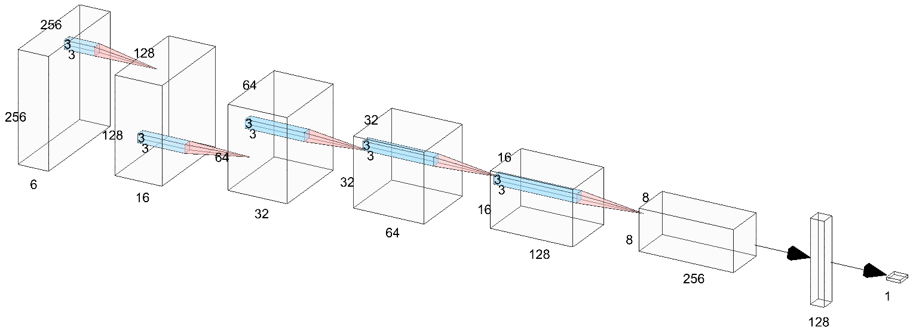
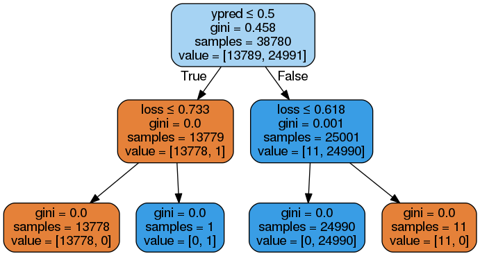

# DupNet

### Dataset

We need a labeled dataset for training but we don't want to go through every potential overlaps and label all the ground truth.
Fortuantely, we don't need to.  Let's see why.
Using our [tile indexing scheme](RESEARCH.md) for a single image, we assert the following 2 statements about any 2 tiles i, j:

1. If `i == j`, the two tiles are duplicates. The tile is simply a copy of itself. 
2. If `i != j`, the two tiles represent the same point in time, but their scenes are disjoint and hence by definition they should not be duplicates.  

Without even looking at an image, these two statements should always be true fundamentally.
But as we have seen, some images contain multiple tiles with the same hash (e.g. clouds, black or blue border).

We build up the dataset by looping over all pairs of tiles in each image.
For each pair, we store the image name, the indexes of the two tiles, and the truth (a 1 if the indexes are the same and a 0 if they are different).
We skip all solid tiles as well as pairs of tiles we have already recorded (e.g. if we already have tiles (2, 4) stored, we skip tiles (4, 2)).
If we want to swap the tile order, we can do that during training.
Each image can therefore contribute a maximum of 36 datapoints (9 dups and 27 non-dups) to the final dataset.
To help balance the labels, we use the BlockMeanHash of each tile to filter out datapoints that are clearly non-duplicate.
This brings the total down to ~4 million datapoints and this number can vary depending on how we filter with BlockMeanHash.
Regardless, 4 million images is overkill.  We always end up randomly sampling down to somewhere between 100k and 200k datapoints, 
after which we then further split into training, validation and testing.  
We find that this is more than enough data to sufficiently train a model capable of outperforming any of the [image metric](IMAGE_METRICS.md) based algorithms. 

---
### Augmentation
We use the following 3 image augmentation methods during training:

1. [JPEG Compression](#jpeg-compression)
2. [HLS shifting](#hls-shifting)
3. [Flips and Rotations](#flips-and-rotations)

#### JPEG Compression
Create a new folder for the `256` jpegs and save each file using the original img_id for the prefix followed by the index according to its location in table 2.
Compare sliced tile with corresponding saved `256` jpeg tile.
We know they are the same image but because of jpeg compression, there are slight variations in some of the pixels.
We get this for free when we create the `256 x 256` tile dataset.

#### HLS shifting
We create a class in [hls_shift](notebooks/eda/hls_shift.ipynb) to compare perturbed and unperturbed versions of the same image.
The perturbed version results from scaling one of the HLS channels of the original unperturbed image
by an integer whose value falls within $\pm 180$ for the Hue channel and $\pm 100$ for the lightness and saturation channels.

The idea here is to perturb the hue, lightness, and/or saturation such that the image still "looks" the same,
but when comparing the sum of the pixelwise deltas, the counts can be in the tens to hundreds of thousands.
For this to work, we need the upper and lower bounds on the three HLS channels.

We used GIMP to create a small dataset of HLS perturbed images. 
Gimp has a nice UI that we could use to save out multiple versions of the same image. 
With each version, we scaled the H, L or S value by $\lambda$ before saving it. 
See the corresponding [README](data/persistent/gimp_hls/README.md) for more details.

We then opened up both the original image and the gimp-scaled copies with OpenCV and
experimented with different HLS offsets to determine at what point the 
image is significantly different enough to be regarded as not a duplicate.

#### Flips and Rotations

We will add horizontal and/or vertical flips.
We'll restrict rotations to 0, 90, 180, and 270 degrees so we don't have to deal with cropping or resizing.
Ensure that **both** images are flipped and rotated the same.

---
### Model

TODO: Describe in words

---
### Performance

We run the observed dup_truth through the trained model and compare the results to the dup_truth labels.
We use a decision_tree classifier to get a sense of how well model performs.
Using the prediction and loss from the model, we obtain outstanding results with only 12 out of the 38k being missclassified.
None of the other image metrics or a combination of them even came close.
See [decision_tree](notebooks/decision_tree.ipynb) for more details.

