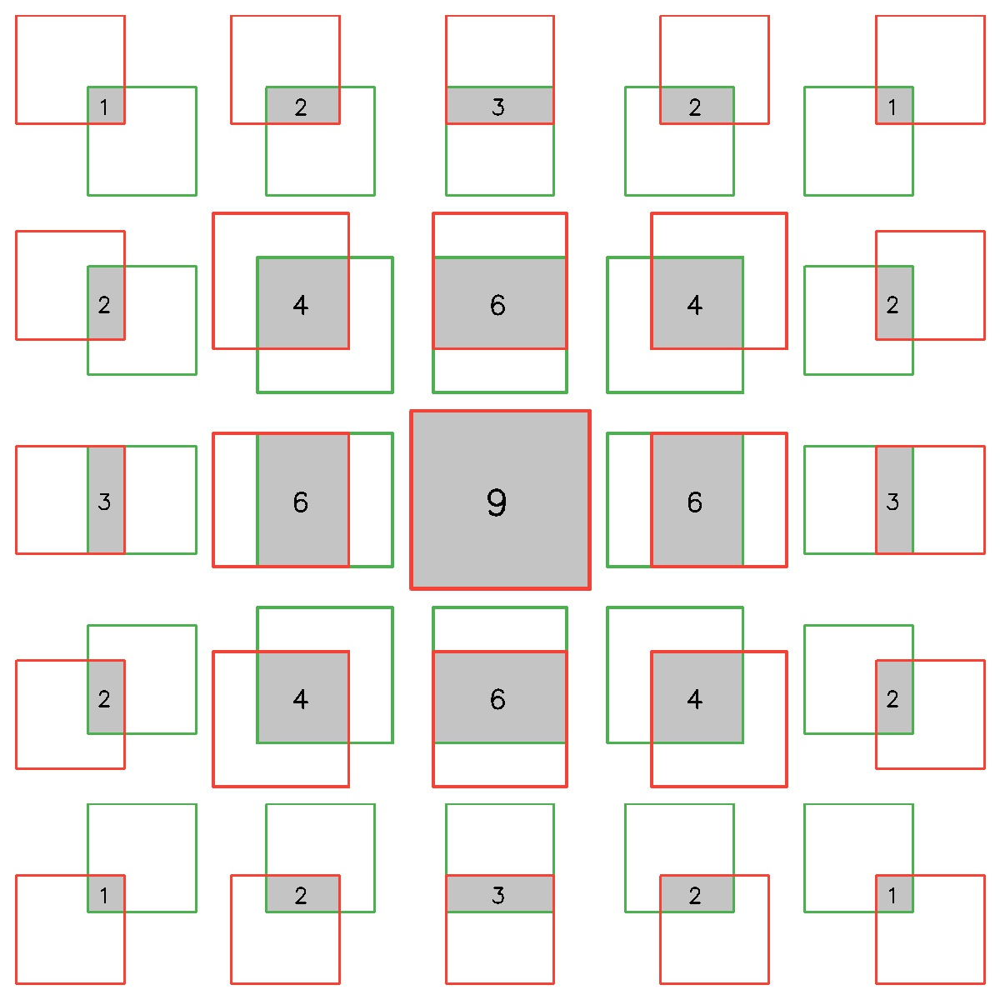
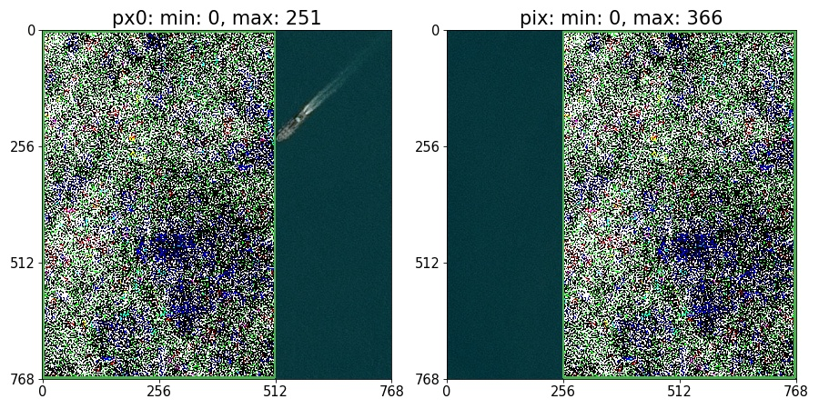

## Introduction

Finding and tagging duplicate satellite images based on overlapping sub tiles.
Like most Data Science ML/AI problems there is usually always something wrong with the data set. 
An incorrect or missing label, duplicate data, a 1 where there should be a -1, etc.
The Airbus_SDC dataset on Kaggle is no exception.
This is not to say that the Airbus_SDC is a bad dataset.
While this is one largest collections of satellite imagery with semantically segmented ships I've seen to date, it does however have one very interesting flaw:
Typically, when creating our training, validation, and test set, we shuffle the source dataset and do something like a 80/10/10 split for example.
But this assumes the dataset follows the rule that there are no duplicate records in the dataset.
This is an important rule. 
If duplicate data points occur across the three datasets, the performance in our validation and testing metrics will yield overconfident values.
This in turn, hinders our ability to detect if the model we are training is overfitting. 
Unfortunately, the Airbus_SDC dataset has a significant amount of duplicate data.
The majority of the duplicate data is in the form of image overlaps which result when cropping `768 x 768` images from the original satellite acquisitions using a stride of `256`.   

---
Because we are dealing with images that can only overlap based on a fixed stride of `256`, it is useful to refer to each `256 x 256` tile in a `768 x 768` image with an index.
The index starts in the upper left corner and moves from left to right as can be seen in the image below.

## Discussion

We cannot compare images directly due to variations in jpeg compression (See [notebook](notebooks/eda/jpeg_compression.ipynb).)
So, we need another way to determine whether two images (and/or overlapping parts of two images) are duplicates.
Before we do that, we need to define what it means exactly for two images to be duplicates. 
For this project we use domain knowledge about the dataset to define two general rules that describe what it means to be _duplicate_. 
1. The geolocation of each pixel in one image must map to the same pixel geolocation in the other image. 
2. The timestamps of the two images must be the same.
  
Unfortunately, we have neither geospatial nor timestamp data for this dataset and thus the only way to tell if two images are duplicate is to compare them visually.
This is a very labor intensive task. 
Comparing all possible pair combinations of 200k images at a rate of 1 pair per second would take over 600 years.
Since only a tiny fraction of these pair combinations are actually duplicates, we will use various image processing algorithms to filter out the pairs that are obviously not duplicates. 
For the rest, we will still need to visually examine and label, not all, but a good portion of the data that can be used as ground truth for evaluating any of the candidate algorithms. 
In terms of visually inspecting images, we can further break down the two rules above into a series of dataset specific questions:

- **ships**:
  If a ship is present in one image, is it also in the other image?
  If so, are the location, heading and wake pattern the same in both images?
  If not, then the two images are definitely not duplicates.
- **terrain**:
  Does the shoreline look the same in both images? 
  Are there areas of vegetation growth in one image and not in the other?
  Are there man-made structures such as buildings in one image that are not in the other?
- **water**:
  Is the water rough (i.e. Are there noticeable wave crests) in both images or is the water smooth and calm?
  If rough, are the wave crests the same in both images?
  If clear, is there evidence of water pollution?
  If so, Does it look the same in both images? 
- **shadows**: 
  Are the directions of shadows the same in both images?
- **clouds**: 
  If distinctively shaped clouds appear in one image, do they also appear in the other image?

---
Here we show an example of a duplicate pair. 
Both images have a single ship which is in the same location and has the same heading and wake pattern.
The water is also somewhat rough in both images and the positions of the wave crests are also the same. 

The two images below are an example of a non-duplicate pair. 
Though these two images are of the exact same geolocation, they were taken at different times, and thus are not considered duplicates according to our definition.
The water in the left image is more rough than in the right image. 
Also, the location of ships are different.

 

---
The two examples above are instances where both images overlap eachother completely.
However, the Airbus_SDC dataset also contains image pairs that overlap partially.
The partitioning scheme used for the Airbus_SDC was to chop up large `6000 x 60000` acquisitions into smaller, more manageable `768 x 768` chunks, using a stride of `256` along both spatial dimensions ([Ref](https://www.kaggle.com/c/airbus-ship-detection/discussion/64675)).
This means that there are at most 25 possible ways in which an image can overlap with another image. 

The overlap patterns are arranged in a `5 x 5` grid to illustrate their symmetry.
For each pattern, the green and red boxes outline of the first and second `768 x 768` images, respectively.
The regions where they overlap is shaded along with the number of `256 x 256` tiles contained in the overlap.
In all there is one 9-tile overlap pattern, four 6-tile overlap patterns, four 4-tile patterns, four 3-tile patterns, eight 2-tile patterns, and four 1-tile patterns.

---
In the following example, only the regions bounded by green boxes are duplicates.

It is usually easy to tell of two images have a duplicate overlap just by looking at them.
However, this is not always the case.  Consider the following example:

Excluding the upper right tile of the first image where the ship is located, these two images look identical.
But what about the rest of the image? 
Which of the 25 patterns, if any, describe their overlap?
Take for example, one possible pattern:

It is hard to tell just by looking at these overlap regions if they are duplicate.
In situations like this we use a technique called average channel subtraction. 
We first find the median of each channel across both images but only for pixels in the overlapping region.
We then subtract from each image the shared channel median.
The trick is to maintain unsigned int8 for the pixel datatype.
Pixels with values less than the median will be forced to wrap around to higher values.
Using this technique, we obtain the modified image.
  

The two images are clearly not duplicates with regard to this particular overlap pattern.
The purple regions in the first image are not present in the second image.
Lets take a look at a different overlap pattern? 

Much better.  The textures look identical. 
As a secondary check, we also print the min/max number of total unequal pixels (left image title) and total pixel difference (right image title) of all `256 x 256` tiles in the overlap region.
In the first overlap example, the best `256 x 256` tile pair has 177888 unequal pixels (~90% difference).
In the second (correct) example, the worst `256 x 256` tile pair has only 251 unequal pixels (~0.1% difference). 
These results seem to suggest that large differences in pixelwise distance metrics imply non-duplicates and small differences imply duplicates. 
But consider the following example:

When we calculate the distance metrics and perform average channel subtraction on the images, we get:

Even though the number of unequal pixels is very large, 
it is visually obvious the two images are duplicates (i.e. same ship location, heading, cargo configuration).
Large differences in distance metrics therefore do not imply non-duplicates.  What about the other way around?
Take a look at the following two extremely cloudy images:

These two look the same but with average channel subtraction (the bottom two images) we see a few tiny differences.
The bottom right tile of the first image is not duplicated anywhere in the second image, and 
the bottom left tile of the second image is not duplicated anywhere in the first.
But that is about all we can say about these two images.
The other 8 tiles are solid white (i.e. [255, 255, 255]), which means we have no way of knowing if these two images correspond to the same location or different locations.
Thus, any overlap patterns that contain all white pixels in both images cannot be labeled duplicate or non-duplicate.
This restriction is not limited to only white tiles but in fact any two tiles having the same solid color. 

--- 
Below we show six examples of images that have at least 2 tiles with the same solid color.
Above each image is the filename and the md5 hash of a single solid tile (indicated by the red bounding box).
We only show the first 8 characters of the md5 hash.

The table below shows the number of images containing solid tiles as well as the total number of solid tiles in the dataset.

| example | md5hash[:8] | # images |  # tiles |
| :---: | :---: | ---: | ---: |
| 001bfb70a.jpg | 0139c6c3 | 344 | 868
| 004f97cfb.jpg | b06a8fb9 | 129 | 387
| 0056fbc62.jpg | b8e3e4c9 | 149 | 447
| 03c807bd1.jpg | 715bd1bf | 102 | 304
| 06709073b.jpg | 232b4413 |  69 | 205
| 5a70ef013.jpg | 11824177 |   7 |  30

The solid tile that occurs most frequently is the all white tile (i.e. clouds).
There are only a few solid black tiles but enough to trip us up if we aren't careful.
The blue tiles represent the borders of the original acquisition.
Note that the hash is different for all 4 sides. 
This is because the inner edge of each blue tile is slightly offset from blue. 
Fortunately, these _solid tile_ edge cases are easy to detect and filter out.

---
I created the [tile_overlap](notebooks/eda/tile_overlap.ipynb) notebook which I use to generate almost every image in this README.
For the sake of brevity, I only included a few examples from the notebook.
There are quite a few more interesting examples so feel free to check them out on your own.
