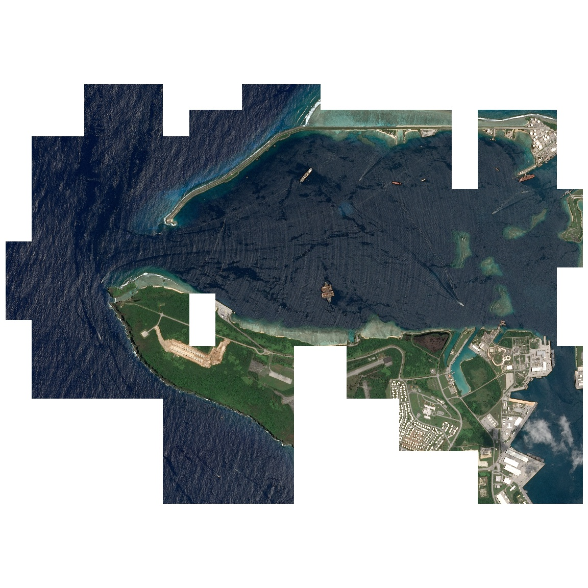
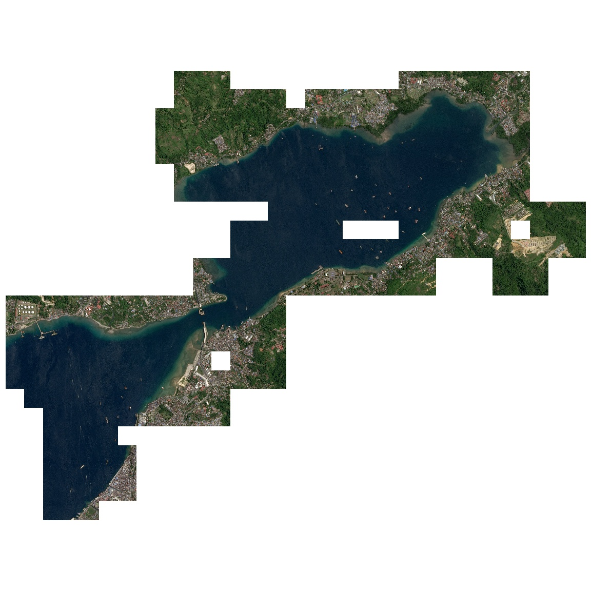
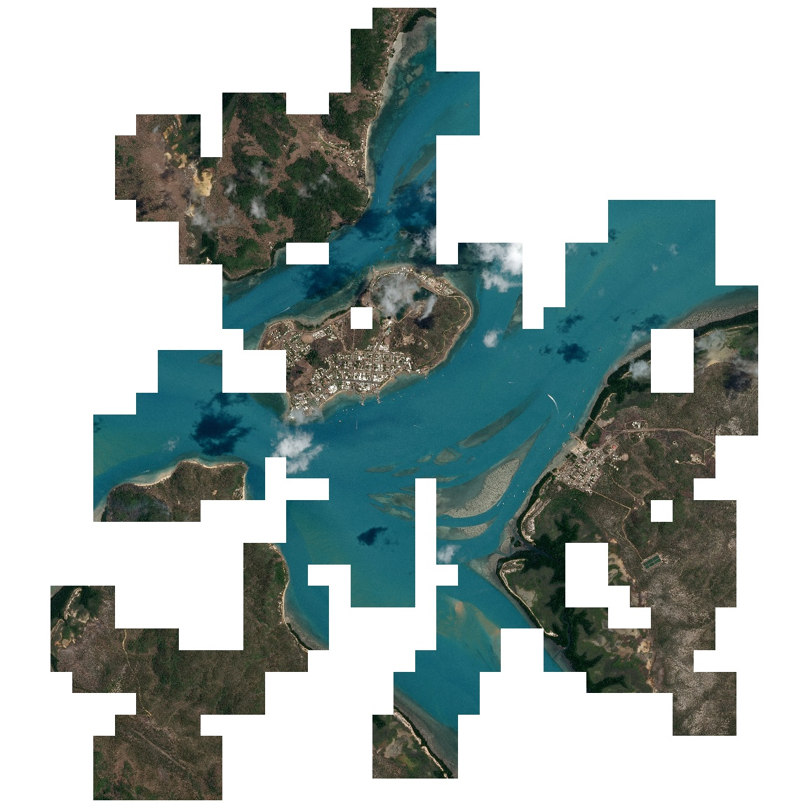
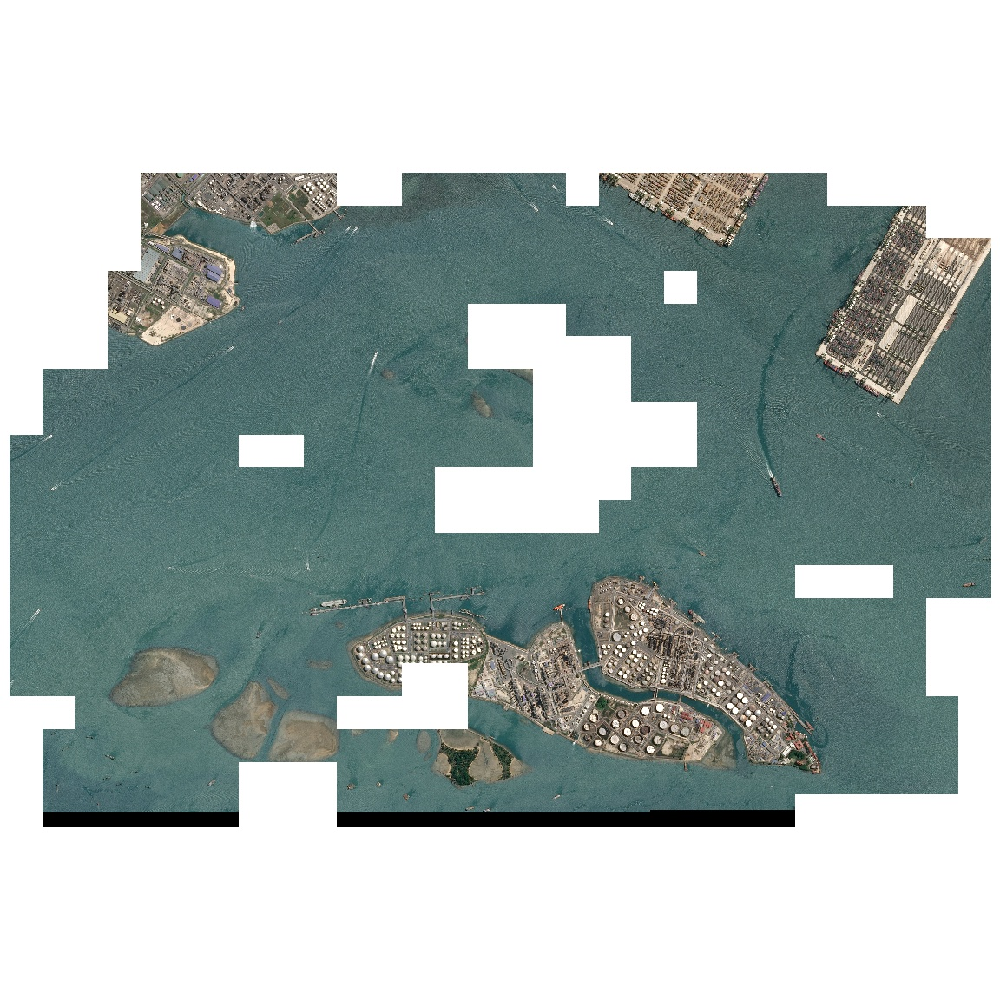
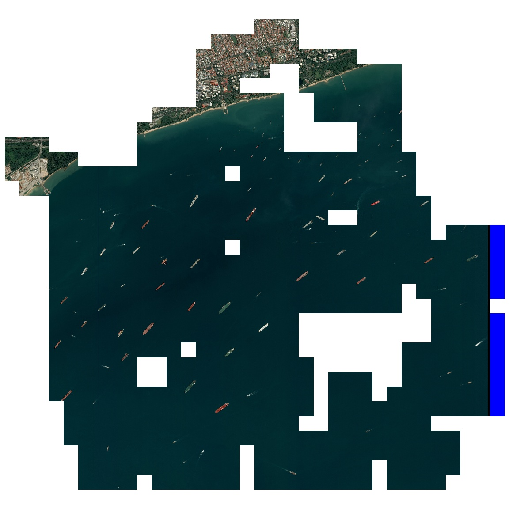
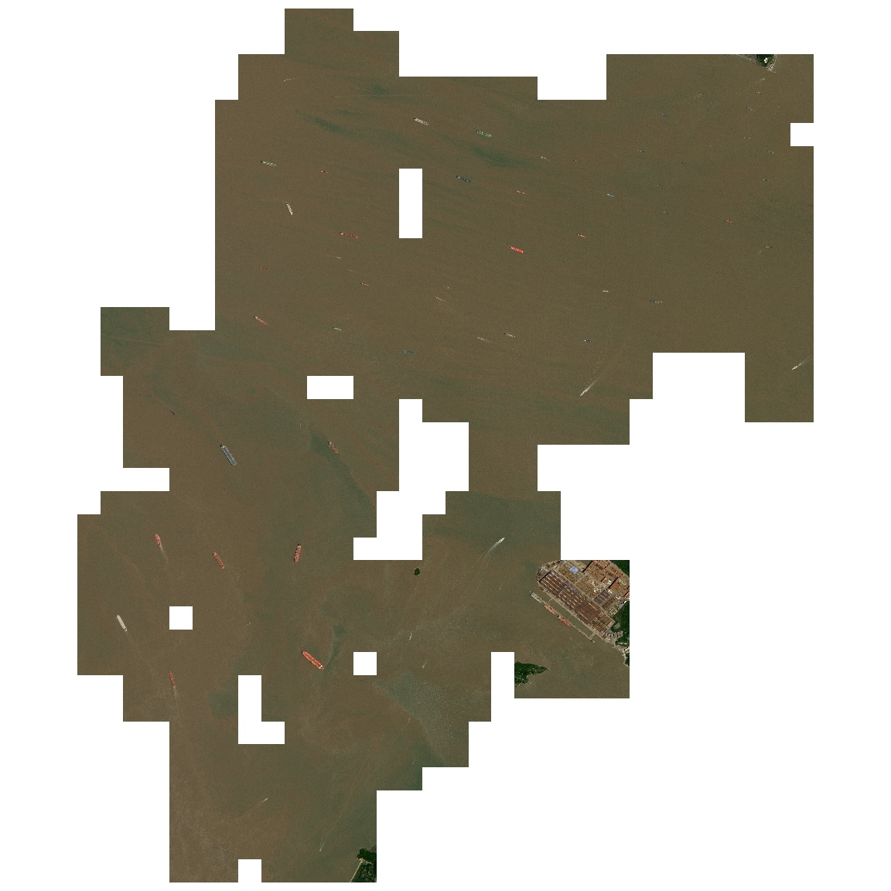
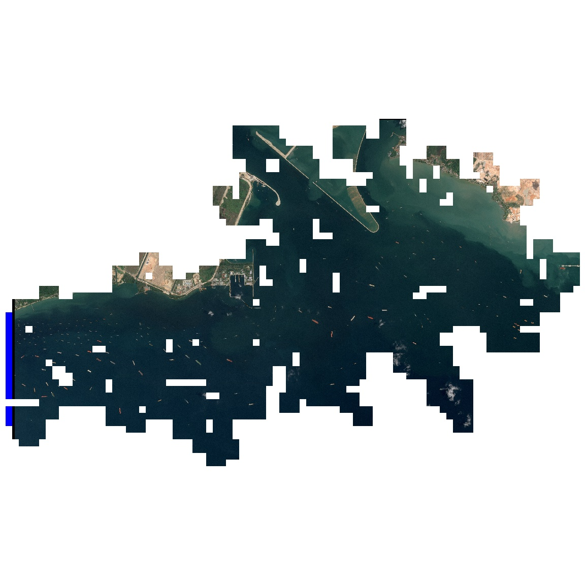
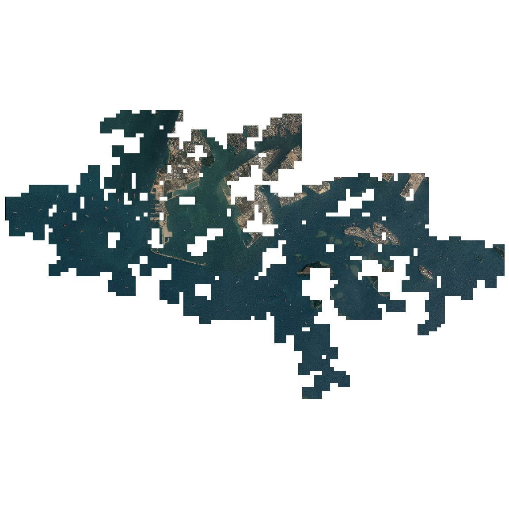

# Results

The final task in this project is to join together all overlapping tiles into groups.  This [Notebook](notebooks/rebuild_overlap_groups.ipynb) contains the rebuilding code.  

Examples of some of the more interesting results are provided below.

..._beautiful_